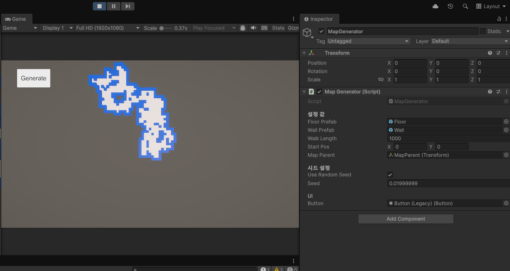

# test1

  무작위 보행(Random Walk) 알고리즘을 활용한 절차적 맵 생성 시스템을 구현합니다.

  

## 주요 기능

*   **절차적 맵 생성:** 무작위 보행 알고리즘을 기반으로 매번 다른 맵 레이아웃을 생성합니다.
*   **동적 환경 구성:** 바닥과 벽 프리팹을 런타임에 동적으로 인스턴스화하여 맵을 구성합니다.
*   **시드 기반 제어:** 임의의 시드 또는 지정된 시드를 사용하여 맵 생성을 제어할 수 있어, 동일한 시드를 사용하면 같은 맵을 재현할 수 있습니다.
*   **유연한 설정:** 보행 길이(`_walkLength`)와 시작 위치(`_startPos`) 등 주요 생성 파라미터를 Unity 에디터에서 쉽게 조절할 수 있습니다.